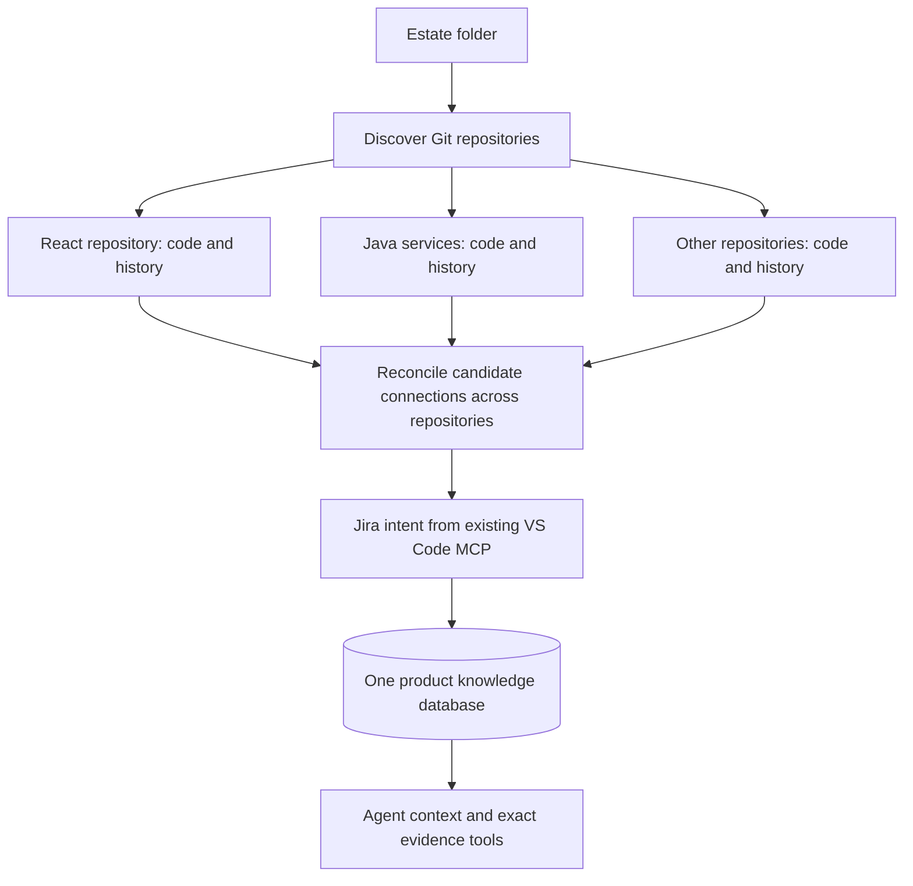

# VR · Portable estate setup

VR 0.2.0 builds one product knowledge base from multiple Git repositories, their history and Jira. This release is intended for a supervised macOS pilot.

## Clone and update through GitHub

This repository contains the source, tests and build scripts. Generated `dist/` files, extension installers, dependency folders and local estate databases are excluded from Git.

For a fresh clone on your work Mac, use Node.js **24 or later** and your configured company package registry:

```sh
git clone git@github.com:swarn2099/vr.git
cd vr
npm install
npm run build
npm run package:extension
npm run setup -- "$HOME/SpendManagementHackathon"
```

Replace the estate path with your actual folder. Run commands one at a time and resolve any error before proceeding. Initial model selection, workspace trust and Jira setup happen in VS Code as described below. Your company's registry must allow the dependency versions; listing a package in its catalog does not guarantee permission to download every version.

For the scanner fix in this update, run the following from your existing VR clone:

```sh
git pull --ff-only
npm run build
node scripts/stop-estate-service.mjs "$HOME/SpendManagementHackathon"
npm run setup -- "$HOME/SpendManagementHackathon"
```

The update preserves `package.json` and `package-lock.json`, so no dependency reinstall is required for this fix. The stop helper verifies and shuts down only this estate's VR service, retaining its database. Cancel any active learning run before using it. Rebuilding alone does not reload an already-running service.

For future updates that change dependencies, run `npm install` before building; for extension/UI changes, also run `npm run package:extension` before setup. If Git reports local changes or a conflict, resolve it before continuing; do not discard your work-Mac dependency adjustments. A clone without an existing local VSIX needs the fresh-clone packaging step above.

Files containing NUL characters are now recorded as excluded with their paths and the reason “binary data or unsupported text encoding.” They do not stop the remaining repository scans. Actual parser/read errors still remain visible on retries. See [scanner-fix verification](verification/scanner-fix-report.md).

## Start on your work Mac

The following route applies to the previously distributed ZIP, which includes built files; GitHub source downloads require the build steps above.

1. Unzip this folder anywhere outside your code repositories.
2. Have Node.js **24 or later**, Git, current VS Code and your work-approved Copilot/model access available. Keep your existing Jira MCP connection configured in VS Code.
3. In a terminal opened in this VR folder, run:

```sh
npm install
npm run setup -- /Users/swarn/Desktop/SpendManagementEstate
```

Keep the unzipped VR folder in place: the VS Code extension starts its service from this folder, using the dependencies installed for your Mac’s architecture. Only the VR folder needs `npm install`. **VR never installs, builds or starts the applications inside your estate.** The supplied package contains built code; rebuilding is not necessary to start.

That command discovers Git repositories under the estate folder, starts a local database, creates one shared product, scans every repository, installs the bundled VR extension and opens the generated VS Code workspace. The terminal and the VR panel show progress as understanding is saved.

Complete any VS Code workspace-trust and model-access dialogs. Select the understanding model once. When Jira is reached, select your existing JQL search tool and enter the Jira site URL and project keys. These account/consent choices happen in VS Code; VR does not copy your credentials or log in on your behalf. An unavailable Jira connector does not stop code learning, and it is reported as an incomplete optional source.

**Installing the VSIX updates `vr-productos.vr-v1` if an earlier VR extension is installed.** Your existing Jira MCP configuration is retained. The generated workspace includes each discovered repository so folder-scoped MCP configurations can remain available; the Jira server may still need to be started in VS Code.

Setup is complete only when progress says **ready**. **ready-with-gaps** means code processing finished but an optional source or semantic index needs attention. **paused** or **failed** means setup is incomplete; the message explains what to do. Unanswered product questions remain visible even when processing is complete.

## Resume and configure

Run the same command again to refresh changed source and resume saved work. Completed interpretations are reused. Rerunning still checks sources for changes and may reread Jira; it does not promise zero network calls.

```sh
npm run setup -- /Users/swarn/Desktop/SpendManagementEstate --history-years 2
npm run setup -- /Users/swarn/Desktop/SpendManagementEstate --jira off
npm run setup -- /Users/swarn/Desktop/SpendManagementEstate --semantic off
npm run setup -- /Users/swarn/Desktop/SpendManagementEstate --max-calls 2000
npm run setup -- /Users/swarn/Desktop/SpendManagementEstate --scan-only
npm run setup -- /Users/swarn/Desktop/SpendManagementEstate --status
```

Defaults: one year of ancestor history, Jira enabled, GitHub disabled, semantic search enabled, and a maximum of 2,000 understanding calls per session. A quota failure or call limit pauses the run honestly. Rerun when the provider is available; no credits are purchased automatically. Cancel in VS Code or press Ctrl+C in the waiting terminal; completed work is retained.

The editable configuration is `<estate>/.vr-estate/estate.json`. It records the shared product, source IDs, repository paths, Jira project selection and stage settings. `VR: Configure Understanding Stages` opens it. The generated workspace and progress live in the same directory. CLI flags override saved settings where specified. Avoid running two setup sessions for the same estate simultaneously; the setup and understanding workers use ownership locks.

GitHub is optional: set `stages.githubIssues` to true and add `github: [{"owner":"organization","repo":"repository"}]` to the estate manifest. The existing GitHub.com connector uses an authorized VS Code GitHub session if one is available. GitHub Enterprise hosts need a separate adapter.

## What VR creates and where data goes

- `.vr-estate/state/postgres`: the local embedded PostgreSQL database; no separate PostgreSQL server or Docker is required.
- `.vr-estate/estate.json`: estate configuration without access tokens.
- `.vr-estate/progress.json`: latest progress, coverage, unresolved-question count and optional-source gaps.
- `.vr-estate/service.log`: local service diagnostics.
- `.vr-estate/Spend-Management-VR.code-workspace`: the workspace to reopen after setup.

If the estate folder is itself a repository, keep `.vr-estate/` out of version control; it contains source excerpts and local state. VR excludes its metadata from analysis. Do not copy a live database or open its files with another database process. Use the running VR service for access. The service is local-only and remains available after setup; it starts again when the estate workspace opens if needed.

**The database is local, but understanding is not an offline operation:** selected code, history and Jira excerpts are sent through your selected VS Code model provider. Use your work-approved account and model. Local semantic search downloads a pinned embedding model on first use; disable it with `--semantic off` if the download is unavailable. Lexical and relationship retrieval remain available. This archive includes no customer repositories, learned knowledge, credentials or benchmark answers.

## How multiple repositories work



Each repository retains independent identity, commits, history, worktree freshness and cached analyses. Findings include repository/source identity so the same relative filename in two repositories is not conflated. Current-code interpretation runs across all repositories before cross-repository reconciliation and historical interpretation. Jira follows those phases. Follow-up investigations can gather source and history from multiple repositories.

Cross-repository discovery currently proposes pairs using shared route strings, contract/type identifiers and named event/queue/service references. The model must interpret the paired evidence, label conclusions as inference, and preserve source anchors. **A name match is not proof of a running integration.** Dynamic configuration, generated contracts, runtime discovery and unmatched routes can remain unresolved. Matching has a visible candidate limit; exhaustive integration discovery is not claimed.

On refresh, unchanged file interpretations are reused. Changed cross-repository evidence causes affected pairs to be reconsidered. A model response is rejected if a participating repository's analyzed checkpoint changed while it was running. Context checks the saved working tree in each repository and marks outdated evidence. It does not change your checked-out branch or pull into it.

## Jira compatibility

VR reuses **advertised JQL search tools** in VS Code. It supports:

- Atlassian Cloud-style tools with `cloudId`, `maxResults` and `nextPageToken`.
- Company-hosted Jira tools such as `jira_search` with `start_at` / `startAt` and `limit` / `maxResults`.
- Jira REST-shaped issues and common flattened issue results.

The selected server must expose its JQL search input schema and structured JSON results. Missing required inputs or an unsupported result shape produce an actionable gap; VR does not assume that every MCP server is interchangeable. Page limits, missing pagination metadata and truncated comments remain visible. Jira change histories are not collected by this adapter. A story's workflow status does not prove implementation.

No new Jira server is installed, and no Jira write tools are invoked. Your work server's actual advertised tool schema must be verified during the first connection; this release has not been tested against your company's server.

## Using the knowledge

Open the generated estate workspace. VR registers one **VR Product Knowledge** MCP server for the entire product, with `vr_context` and `vr_evidence`. Enable/trust that server in VS Code when requested. Ask your agent to use VR context before assessing or changing a feature, and to inspect cited evidence for consequential conclusions. `VR: Get Context for a Task` is the explicit fallback. The portable workflow uses explicit MCP tools; it does not claim that every agent request automatically receives context.

Use **VR: Review Questions and Knowledge** to inspect gaps and record attributed, versioned clarifications. Use **VR: Learn or Resume Estate** after a refresh or to process a queued investigation. New facts do not silently replace older source evidence.

## Verification and limits

`verification/` contains recorded checks. The end-to-end host test uses the real setup command, compiled extension, local service and database with three temporary repositories, including React and Java. VS Code UI APIs, the language model and Jira transport are controlled test doubles. It verifies setup orchestration, not model accuracy or your work-account authorization. The public six-run benchmark belongs to the preserved 0.1.0 release and is not evidence that this new release improves agent performance.

For development:

```sh
npm run typecheck
npm test
npm run build
node scripts/test-portable-host.mjs
npm run package:extension
npm run bundle
```

This release adds estate onboarding and cross-repository understanding. It is not a claim of complete Spring runtime analysis, arbitrary MCP compatibility, enterprise identity enforcement or production deployment verification.
